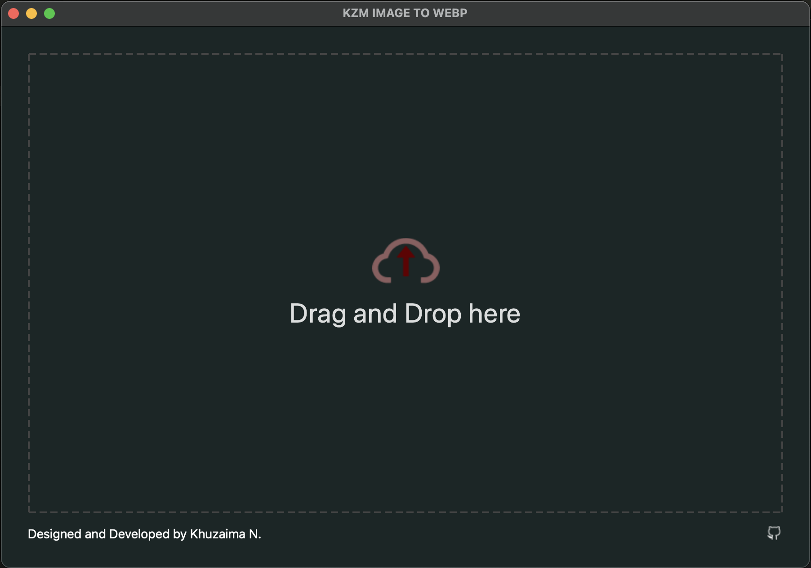
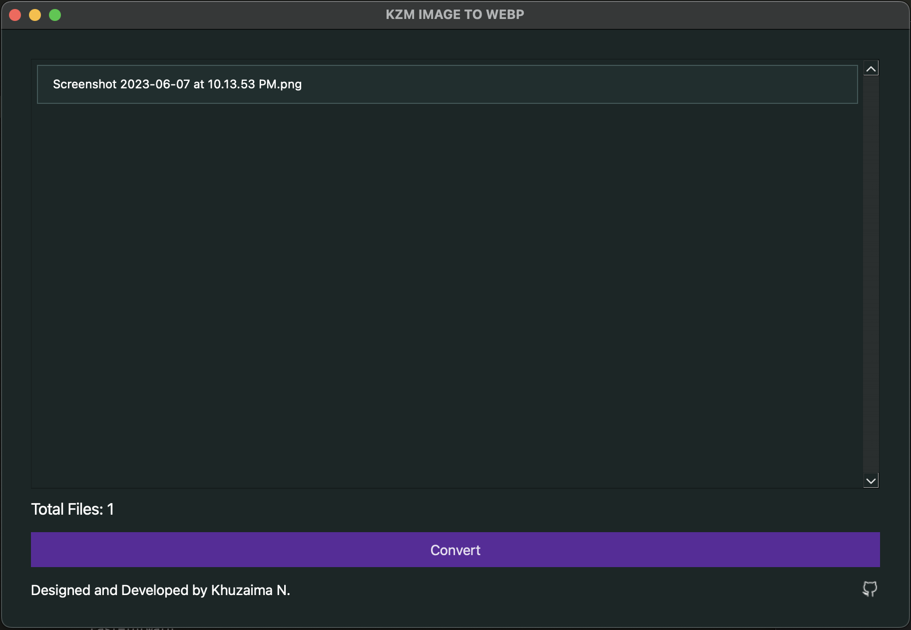
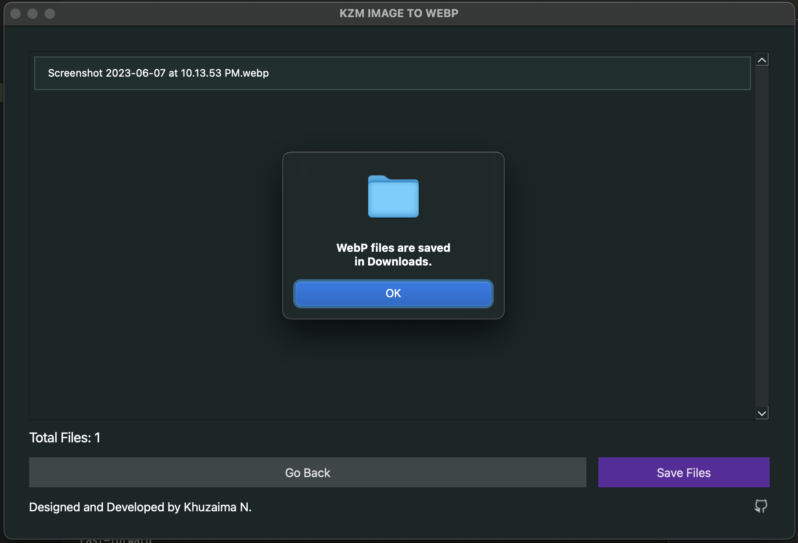

## WebP Converter 🎛️

- A desktop application that allows you to convert image files to the WebP format.
- User-friendly interface for selecting and converting multiple image files at once. 
- Strickly following the design from Figma, prepared [here](https://www.figma.com/file/HnLPap7IYzPJAhKSRwNFyE/Convert-to-WebP?type=design&node-id=0-1&t=LnXqhTRKqZVdM4mT-0)

## Screenshots

### Drag and Drop

### Visibility

### On Success 

## Features 💥

- Drag and drop support
- Multiple file formats supported
- Conversion list
- Save converted files

## How to Run 🚀

- Clone the repository: git clone https://github.com/kzmfhm/pyqt6-webp-file-converter.git
- Navigate to the project directory: cd webp-converter
- Create a virtual environment (optional): python3 -m venv venv
- Activate the virtual environment:
        For Linux/Mac: source venv/bin/activate
        For Windows: venv\Scripts\activate.bat
- Install the required dependencies: pip install -r requirements.txt
- Run command in root directory: python3 main.py
 
## Usage 📃

- Drag and drop image files onto the application.
- Click the "Convert" button to convert the selected image files.
- Click the "Save Files" button to save the converted WebP files.
- Checkout Downloads because these webp files are saved in Downloads.

## Note 📃

- After activating venv environment,make sure to run "python3 main.py" file within venv and static folder directory.If you are not doing this background images were not displayed properly.

## ⭐️ Support

Give a ⭐️ if this project helped you!!

## License ©

[The MIT License](LICENSE)